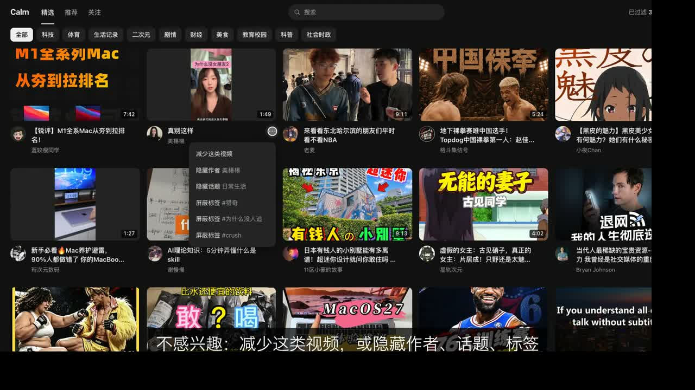

# Calm Douyin

Calm Douyin is a Chrome extension for www.douyin.com. It replaces Douyin's interface with a quiet one of its own, and it removes low-quality videos before they load.

## Demo

[](demo/calm-douyin-demo.mp4)

Click the picture to open the video (62 seconds, with sound). The video shows the home grid, the topic filter, the "不感兴趣" menu, the filtered list, the plain player and the learning settings. The learned tags in the settings scene are sample data.

## What it does

- **Own interface.** Douyin's side navigation, header, promotions and grid do not show. You get a top bar (精选, 推荐, 关注, search, profile) and a home grid in the style of an ordinary video site. The text is Chinese. The interface follows the light or dark setting of the system. There are no like counts.
- **Motion that shows what changed.** A cover grows into the player. Cards move to their new place when you change the topic or hide a creator.
- **Filter at the data layer.** The extension reads each feed response before Douyin sees it and takes the unwanted items out. They do not reach the gallery, and they do not reach the player queue.
- **Douyin's own player.** A click on a card opens Douyin's native player. Your watch time, likes and saves still reach Douyin, so its recommendations keep learning from the good videos that you watch.
- **Block in one click.** Each card and the player have a "不感兴趣" menu: fewer videos of this kind (in the player this also sends Douyin's own "不感兴趣", so its recommendations change too), hide the creator, hide the topic (Douyin's own category), or block one of the video's hashtags.
- **Learns from your habits.** A video that you leave within 3 seconds is a vote against its hashtags, its categories and the words of its caption. A video that you watch to 70 %, or like, or save, is a vote for them. A hashtag with 3 votes against it (a category with 4, a word with 8) and almost none for it becomes a filter. The popup shows each learned filter, and you can remove it there. The votes stay in `chrome.storage.local`.
- **A plain player.** Douyin's player keeps the video, the caption, four actions (like, comment, save, share), and a short control bar (play, time, speed, sound, full screen). The series bar, the AI button and the other extras do not show. Bullet comments are off by default; turn them on in the popup.
- **Tells you why.** The dot in the top bar counts the filtered videos. Click it to see each one with its reason.
- **Helps you stop.** An optional pause screen comes up after 20, 40 or 60 minutes of watch time in a day.

## Install

1. Open `chrome://extensions` in Chrome (version 114 or later).
2. Turn on **Developer mode** (top right).
3. Click **Load unpacked**, then select this folder. After an update, click the reload arrow on the extension card.
4. Open https://www.douyin.com/jingxuan and sign in as usual.
5. Click the crescent icon in the toolbar to change the rules.

## What it filters

| Filter | Signals |
| --- | --- |
| AI-generated | Douyin's notice under the video (`作者声明：内容由 AI 生成`, `疑似使用了 AI 生成技术`), its AIGC flags and its categories (`AI原生影像`, `AI创作剧场`, `AI原创短片`). Also AI hashtags and captions (`ai漫剧`, `即梦`, `可灵`, `LibTV`). |
| Recaps and re-cuts | Categories such as `电影剧情解说` and `电视剧混剪`. Also hashtags such as `电影解说`, `一口气看完` and `二创`. |
| Short drama | Categories and hashtags for `短剧` and `漫剧`. Trope hashtags such as `#霸总` count only as whole hashtags. |
| Staged skits | Douyin's notice `作者声明：虚构演绎`. |
| Ads | `is_ads` and ad payload fields. |
| Live streams | Live-room cards in the feed. |
| Shopping | Product cards and selling words (`小黄车`, `团购`, `优惠券`). |
| Clickbait | Strong bait words (`震惊`, `看到最后`), stacked weak bait words, and hashtag spam. |
| Slideshows | Photo posts. This filter is off by default. |

**Strictness** sets two soft signals:

- **Engagement depth.** The count of saves, shares and comments for each like. People save and share useful videos.
- **Mild bait.** How many weak bait words a caption can have.

**Focus mode** keeps a video only when its caption, hashtags or category match one of your topics.

**Block and allow** holds your own lists: words, creators, hidden topics, and creators that always pass.

On a sample of 69 live 精选 items, 30 were AI-generated. The default rules kept 24.

## Where it applies

- Filtering applies to the discovery surfaces: 精选, 推荐, related videos and search results.
- Following, Friends and profile pages stay as they are, because you chose those creators.
- A rule change applies to the gallery at once, and to the player queue for the videos that load next.
- Turn off **Calm interface** in the popup to get classic Douyin back. The filter stays on.

## How it works

```
manifest.json
src/
  shared/settings.js     Settings schema and normalize()
  shared/classifier.js   lite(aweme) -> small item; judge(item, settings) -> { keep, reasons }
  page/interceptor.js    MAIN world: reads and rewrites XHR / fetch feed responses
  content/boot.js        Isolated world: loads content.js as an ES module
  content/content.js     State for the tab; drives Douyin's page under the Calm interface
  content/app.js         The Calm interface (shadow root): top bar, gallery, player tools
  content/app.css        Styles for the Calm interface
  content/theme.css      Page styles: removes Douyin's chrome, quiets the native player
  popup/                 Settings popup
  background.js          Closes the tab from the pause screen
scripts/make-icons.mjs   Draws the PNG icons (no dependencies)
```

Some details are not easy to see from the code:

- **One file, one world.** Chrome injects a given content-script file into only one world per page. The MAIN world gets `settings.js` and `classifier.js` from the manifest. The isolated world imports the same files as ES modules through `boot.js`. Do not list a shared file in both manifest entries.
- **Douyin's page stays alive under the gallery.** On 精选, Douyin's own grid is kept with `visibility: hidden`. The gallery asks for more items by scrolling that hidden list, which fires Douyin's own signed request. Each hidden card is made tall, so the list can always scroll.
- **The player opens through Douyin's card.** A click on a Calm card clicks the matching hidden Douyin card. If the modal does not open, the extension goes to `/video/<id>`.
- **Closing the player.** Douyin opens the modal with `replaceState`, so `history.back()` leaves the site. The "Back" control clicks Douyin's own (invisible) close button.
- **64-bit IDs.** Douyin sends some 64-bit integers as bare JSON numbers. The interceptor uses `JSON.rawJSON`, so a rewritten response keeps these numbers exact.
- **The feed must not go empty.** If every item of a response fails the rules, the interceptor keeps the mildest item. The gallery leaves it out, and the player skips past it.
- **Douyin keeps old players in the DOM.** When you go from For You to Following, the For You player stays, with `display: none`. `activeVideo()` in `content.js` returns only the slide that has a size.
- **No rule may hide a player.** A live room in a feed is a link to `live.douyin.com` that covers the slide, so `theme.css` hides nothing by link or by live status. `markByText` hides a label only together with wrappers that add no other text and no media.
- **Backgrounds go on named elements only.** Signed-in Douyin puts full-screen portals (private messages) in `#root`, over the page, with no background. A rule such as `#root > div { background }` paints them black and hides every page. This was the cause of the blank 推荐, 关注 and profile pages.
- **An empty player tab gets a message.** If 推荐 or 关注 has no player after 8 s, the Calm interface shows a message with Reload.
- **Stable hooks only.** The CSS and DOM code use element IDs, `data-e2e` attributes and semantic class names. Douyin's hashed class names change with each release.

To change the icons, edit `scripts/make-icons.mjs` and run:

```bash
node scripts/make-icons.mjs
```

## Privacy

All data stays in your browser in `chrome.storage.local`. The extension makes no network requests of its own.
